# LAVA — Evidence-Grounded Multilingual Document Intelligence on AWS

[](https://github.com/alvaromendizabal/lava-aws-multilingual-docvqa/actions/workflows/ci.yml)

LAVA is a research-grade multilingual document-intelligence system built to separate **reader quality**, **retrieval quality**, and **systems cost** under a frozen, leakage-resistant evaluation protocol. The project combines open vision-language models, immutable model/data lineage, AWS SageMaker GPU execution, structured artifact verification, and reproducible public analysis notebooks.

## Current verified reader ladder

| Reader | SageMaker target | Status | Smoke verification |
| --- | --- | --- | --- |
| Qwen3.5-4B fused direct | `ml.g5.2xlarge` | Verified | Schema-valid response and artifact gate passed |
| Qwen3.5-9B fused direct | `ml.g6e.2xlarge` | Verified | 350 billable seconds, 1/1 raw response, schema-valid rate 1.0, zero parser errors |
| Qwen3.8-27B fused direct | `ml.g7e.12xlarge` | Next | High-memory single-GPU contract; smoke benchmark pending |

Hardware is part of the frozen model contract. The 9B reader stays on the **known-good LAVA `ml.g6e.2xlarge` path**. The 27B reader is not forced onto a smaller G6 instance: its contract requires at least 80 GiB of CUDA memory on one device and therefore targets `ml.g7e.12xlarge`.

## Architecture

```mermaid
flowchart LR
    A[Frozen multilingual evaluation protocol] --> B[Oracle evidence assets]
    B --> C[Reader benchmark]
    C --> D[4B / 9B / 27B VLM ladder]
    D --> E[SageMaker GPU jobs]
    E --> F[Private raw responses in S3]
    F --> G[Fail-closed artifact gate]
    G --> H[Sanitized public summaries]
    H --> I[Notebooks / metrics / figures]
    I --> J[Retrieval + reranking benchmark]
```



See [`docs/architecture.md`](docs/architecture.md) for the execution and lineage model.

## Reproducible workflow

The public interface is intentionally small. Historical phase-specific wrappers have been removed.

```bash
# Local quality and reproducibility gate
make quality

# No-cost AWS/data/quota/cost preflight for the already-verified 9B path
make preflight MODEL=qwen35_9b_fused_direct

# Preview a one-question plan; creates no paid GPU resource
make preview MODEL=qwen35_9b_fused_direct

# Paid submission is explicitly locked
make submit MODEL=qwen35_9b_fused_direct CHARGES=YES

# 27B preview uses the frozen ml.g7e.12xlarge model contract
make preflight MODEL=qwen38_27b_fused_direct
make preview MODEL=qwen38_27b_fused_direct
```

Completed jobs are reconnectable and independently verifiable:

```bash
make monitor JOB=<sagemaker-job-name>
make verify JOB=<sagemaker-job-name>
make sync JOB=<sagemaker-job-name>
make stop JOB=<sagemaker-job-name> CONFIRM=YES
```

## Engineering guarantees

- Python 3.12 environment locked with `uv.lock` and `uv sync --frozen`.
- Ruff formatting/linting, repo-wide Mypy, Pytest, compile checks, shell syntax checks, notebook hygiene, and Git diff validation run through one fail-closed quality gate.
- GitHub Actions runs that same quality gate instead of maintaining a second CI implementation.
- Model repositories and revisions are pinned; benchmark protocol and oracle assets carry immutable lineage identifiers.
- Paid SageMaker runs require explicit operator acknowledgement and conservative cost ceilings.
- Runtime events include UTC timestamps, stage timings, and heartbeats for long operations.
- Public reports contain sanitized aggregate metadata; private questions, answers, page images, raw model responses, bucket names, and identifiers remain outside Git.

## Notebooks

The notebooks are paired with Jupytext so the `.ipynb` files remain convenient for readers while `.py` sources remain reviewable and testable.

1. `00_reproducibility_and_protocol` — frozen protocol, model registry, deterministic experiment contract.
2. `01_oracle_reader_benchmark_design` — controlled reader ladder and ablation design.
3. `02_verified_gpu_execution` — verified SageMaker run lineage and artifact-gate results.
4. `03_model_scaling_and_cost` — sanitized model-size, latency/billable-time, reliability, and cost-facing dashboard as benchmark results accumulate.

## Research program

The current milestone isolates reader capability with oracle evidence. The next benchmark layer evaluates 4B → 9B → 27B scaling, modality ablations, multilingual slices, error taxonomy, latency/throughput/VRAM, and cost-quality Pareto behavior. Retrieval and reranking are then introduced under the same frozen document-isolated protocol so retrieval failures cannot be confused with reader failures.

## Repository layout

```text
configs/           frozen benchmark and model contracts
docs/              architecture and methodology
infra/terraform/   reproducible AWS infrastructure
notebooks/         public Jupytext-paired analysis notebooks
pipelines/         GPU job entrypoints and pinned runtime dependencies
reports/           sanitized public manifests, metrics, and figures
scripts/           small canonical operational interface
src/lava/          tested application and research library
tests/             unit, integration, and regression contracts
```

The repository intentionally avoids historical `fix`, `repair`, `patched`, and phase-specific duplicate implementations. Corrections are made in the canonical source files and validated by tests and CI.
