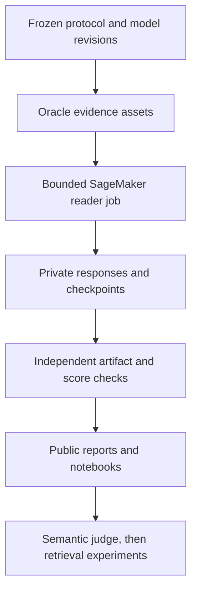

# LAVA — Evidence-Grounded Multilingual Document Intelligence on AWS

[](https://github.com/alvaromendizabal/lava-aws-multilingual-docvqa/actions/workflows/ci.yml)

LAVA is a research-grade multilingual document-intelligence system built to separate **reader quality**, **retrieval quality**, and **systems cost** under a frozen, leakage-resistant evaluation protocol. The project combines open vision-language models, immutable model/data lineage, AWS SageMaker GPU execution, structured artifact verification, and reproducible public analysis notebooks.

## Current verified results

| Reader | SageMaker target | Verified scope | Billable seconds |
| --- | --- | --- | --- |
| Qwen3.5-4B fused direct | `ml.g5.2xlarge` | **Complete pilot: 16 questions / 5 documents** | **380** |
| Qwen3.5-9B fused direct | `ml.g6e.2xlarge` | **Complete pilot: 16 questions / 5 documents** | **395** |
| Qwen3.8-27B NF4 fused direct | `ml.g5.2xlarge` | One-question smoke | 783 |

| Complete pilot | Question-average score | Document-average score | Mean generation | Peak allocated GPU memory |
| --- | ---: | ---: | ---: | ---: |
| 4B | 38.13% | 43.83% | 5.52 s | 10.95 GiB |
| 9B | 45.77% | 39.71% | 3.61 s | 20.15 GiB |

Both complete pilots have **100% valid output** and no parser errors. Answer scores
are normalized-exact diagnostics with partial list credit. Every raw generation,
question, score, and aggregate was independently checked against the frozen manifest;
all **16 immutable 9B checkpoints** were also verified against the final records.

The comparison is mixed: 9B improves two documents, ties two, and regresses on one.
Its question-average gain is **7.65 percentage points**, while its document-average
change is **−4.12 points**. The exploratory document-bootstrap interval is
**−43.17 to +25.98 points**, with an exact paired two-sided p-value of **1.000**.
There is no promotion decision from five documents. Hardware differs between runs;
generation time is an observed system result, not a controlled model-speed comparison.

Only one reader is needed for deployment. Preserve these completed runs. Next,
audit shared failures and expand representative evaluation before selecting a reader.
27B remains an optional comparison. The configured 27B candidate uses a
different model generation and NF4 quantization, so the comparison also changes
precision and model family version. This small pilot does not establish SOTA quality.

[View the report source](reports/oracle_reader/evaluation/index.html) ·
[Evaluation workflow](docs/evaluation.md) · [Aggregate results](reports/oracle_reader/evaluation/summary.json)

## Architecture



See [`docs/architecture.md`](docs/architecture.md) for the execution and lineage model.

## Reproducible workflow

The public interface is intentionally small. Historical phase-specific wrappers have been removed.

```bash
# Local quality and reproducibility gate
make quality

# Rebuild the offline public dashboard
make report

# Optional 27B plan review; no GPU is launched
make benchmark-preview MODEL=qwen38_27b_nf4_g5_fused_direct
```

Reconnect to active jobs; independently verify and synchronize completed jobs:

```bash
make monitor JOB=<sagemaker-job-name>
make verify JOB=<sagemaker-job-name>
make sync JOB=<sagemaker-job-name>
make stop JOB=<sagemaker-job-name> CONFIRM=YES
```

For a Failed or Stopped benchmark, preserve the source Git checkout and resume
validated S3 checkpoints instead of recomputing completed answers:

```bash
make benchmark-resume-preview MODEL=qwen35_9b_fused_direct JOB=<failed-job-name>
make benchmark-resume MODEL=qwen35_9b_fused_direct JOB=<failed-job-name> CHARGES=YES
```

This applies to new jobs created with durable checkpoint support. Replacement jobs
are billed; instance provisioning and any necessary model loading recur. An
interrupted question without a durable checkpoint may be repeated. See the
[evaluation and recovery guide](docs/evaluation.md) for the complete contract.

Accepted SageMaker jobs continue when the terminal disconnects or the operator
signs out. The local monitor can reconnect by job name; it is not the job executor.
Cloud runtime limits still apply. Two-job concurrency remains a planned, separately
tested runner capability; the current submission guard allows one active LAVA job.

## Engineering controls

- Python 3.12 environment locked with `uv.lock` and `uv sync --frozen`.
- Ruff formatting/linting, repo-wide Mypy, Pytest, compile checks, shell syntax checks, notebook hygiene, and Git diff validation run through one fail-closed quality gate.
- GitHub Actions runs that same quality gate instead of maintaining a second CI implementation.
- Model repositories and revisions are pinned; benchmark protocol and oracle assets carry immutable lineage identifiers.
- Paid SageMaker runs require explicit operator acknowledgement and conservative cost ceilings.
- Runtime events include UTC timestamps, stage timings, total elapsed time, progress, and heartbeats.
- Immutable S3 question checkpoints preserve exact generations and scored records; compatibility checks and interruption tests enforce safe reuse across attempts.
- Public reports contain sanitized aggregate metadata; private questions, answers, page images, raw model responses, bucket names, and identifiers remain outside Git.

## Notebooks

The notebooks are paired with Jupytext so the `.ipynb` files remain convenient for readers while `.py` sources remain reviewable and testable.

1. `00_reproducibility_and_protocol` — frozen protocol, model registry, deterministic experiment contract.
2. `01_oracle_reader_benchmark_design` — controlled reader ladder and ablation design.
3. `02_verified_gpu_execution` — verified SageMaker run lineage and artifact-gate results.
4. `03_model_scaling_and_cost` — checksum-verified offline dashboard with coverage, latency, VRAM, billable time, document comparisons, and lineage.

## Research program

The current milestone isolates reader capability with oracle evidence. Further experiments can compare model candidates, modality ablations, multilingual slices, error categories, runtime, memory, and cost. A validated semantic judge and a larger representative evaluation set are required before broad quality claims. Retrieval and reranking are then introduced under the same frozen document-isolated protocol so retrieval failures cannot be confused with reader failures.

## Repository layout

```text
configs/           frozen benchmark and model contracts
docs/              architecture and methodology
infra/terraform/   reproducible AWS infrastructure
notebooks/         public Jupytext-paired analysis notebooks
pipelines/         GPU job entrypoints and pinned runtime dependencies
reports/           sanitized public manifests, metrics, and figures
scripts/           small canonical operational interface
src/lava/          tested application and research library
tests/             unit, integration, and regression contracts
```

The repository intentionally avoids historical `fix`, `repair`, `patched`, and phase-specific duplicate implementations. Corrections are made in the canonical source files and validated by tests and CI.
