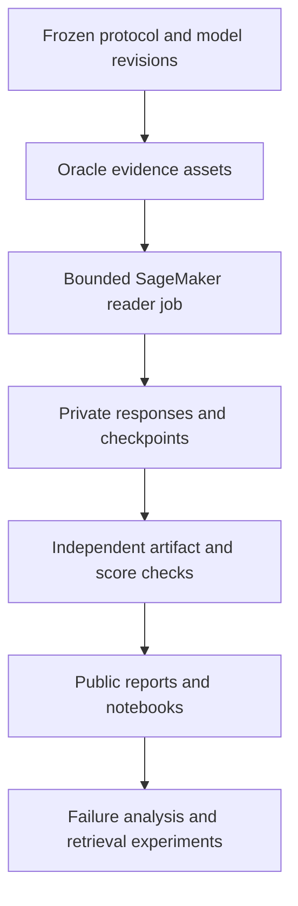

# LAVA — Evidence-Grounded Multilingual Document Intelligence on AWS

[](https://github.com/alvaromendizabal/lava-aws-multilingual-docvqa/actions/workflows/ci.yml)

LAVA is a research-grade multilingual document-intelligence system built to separate **reader quality**, **retrieval quality**, and **systems cost** under a frozen, leakage-resistant evaluation protocol. The project combines open vision-language models, immutable model/data lineage, AWS SageMaker GPU execution, structured artifact verification, and reproducible public analysis notebooks.

## Read the executed notebooks

Start with [02 — Verified GPU execution](reports/notebooks/02_verified_gpu_execution.ipynb),
then [03 — Which reader should we use?](reports/notebooks/03_model_scaling_and_cost.ipynb).
These GitHub-viewable snapshots include actual outputs, timestamps, metric tables
and charts from the completed three-model comparison. Each has a checksum manifest
binding it to the editable source and analysis inputs. Canonical editable notebooks
remain in `notebooks/`; publication snapshots are tested separately and retain outputs.

## Current verified results

| Reader | SageMaker target | Verified scope | Billable seconds |
| --- | --- | --- | --- |
| Qwen3.5-4B fused direct | `ml.g5.2xlarge` | **Complete pilot: 16 questions / 5 documents** | **380** |
| Qwen3.5-9B fused direct | `ml.g6e.2xlarge` | **Complete pilot: 16 questions / 5 documents** | **395** |
| Qwen3.8-27B NF4 fused direct | `ml.g5.2xlarge` | **Complete pilot: 16 questions / 5 documents** | **962** |

| Complete pilot | Question-average diagnostic | Document-average diagnostic | Evidence-page F1 | Mean generation | Peak GPU memory |
| --- | ---: | ---: | ---: | ---: | ---: |
| 4B | 38.13% | 43.83% | 97.02% | 5.52 s | 10.95 GiB |
| 9B | 45.77% | 39.71% | 93.90% | 3.61 s | 20.15 GiB |
| 27B NF4 | 33.48% | 29.88% | 89.73% | 12.24 s | 20.63 GiB |

These are **full 16-question pilots**, not just smoke tests. Notebook 02 and the
dashboard now prioritize current coverage; historical smokes appear in run history.
The [published LAVA metric](https://lava-workshop.github.io/#evaluation) averages
semantic answer credit and predicted evidence-page F1 per question. Semantic credit
uses a Gemma-3 1B judge. The original runs retained normalized-exact diagnostics.
Semantic scores are now independently evaluated from their saved answers:

| Reader | Semantic VQA | Evidence-page F1 | Local LAVA overall |
| --- | ---: | ---: | ---: |
| 4B | **50.63%** | 97.02% | **73.82%** |
| 9B | **80.15%** | 93.90% | **87.02%** |
| 27B NF4 | **70.98%** | 89.73% | **80.36%** |

The pinned CPU judge passed all **28 public controls**. Scoring both pilots took
**65.13 seconds** on the existing Studio CPU; a second run took **7.71 seconds**,
reused all **129 decision requests**, and loaded no model. See the
[real-model validation and resume evidence](reports/oracle_reader/judge_validation.json).

The canonical evaluator now reuses verified saved answers, writes immutable judge
decisions to S3, and resumes without repeating accepted decisions. It pins the
Gemma checkpoint, prompt, dependencies, and independent acceptance probes. Google
requires authorized access to [Gemma](https://huggingface.co/google/gemma-3-1b-it).
The organizer's exact judge prompt/runtime is unpublished; local formula-based
scores are explicitly distinct from organizer-server results. Oracle citation F1
does not measure retrieval quality.

The 4B and 9B pilots have **100% valid output** and no parser errors. The 27B
pilot has **93.75% valid output**: one contradictory abstention is retained as a
model failure, with all 16 questions still in the denominator. The first table of answer scores
contains normalized-exact diagnostics with partial list credit; the semantic table
uses the separately validated Gemma judge. Every raw generation,
question, score, and aggregate was independently checked against the frozen manifest;
all **16 immutable checkpoints** in each of the 9B and 27B runs were also verified
against the final records.

The normalized-exact comparison is mixed: 9B improves two documents, ties two, and regresses on one.
Its question-average gain is **7.65 percentage points**, while its document-average
change is **−4.12 points**. The exploratory document-bootstrap interval is
**−43.17 to +25.98 points**, with an exact paired two-sided p-value of **1.000**.
Under semantic judging, 9B improves three documents, ties one, and regresses on
the sole Vietnamese document. Its document-average semantic VQA is 76.38%, versus
53.83% for 4B. There is no promotion decision from five documents. Hardware differs between runs;
generation time is an observed system result, not a controlled model-speed comparison.

**Keep 9B as the provisional reader.** The complete 27B comparison is now scored:
27B is **6.67 percentage points lower** on question-average local LAVA overall
and **1.58 points lower** when each PDF has equal weight. It improves one PDF,
ties two and regresses on two. Its exploratory document-bootstrap interval is
**−14.75 to +12.50 points**; five PDFs cannot establish held-out superiority.
27B improves unordered-list answer credit and the single Vietnamese example,
but those small slices cannot establish a general language or format advantage.

The 27B run completed in **16m 51s wall time**, with **962 billable seconds**.
Estimated training compute is **$0.405**, compared with **$0.307 for 9B** and
**$0.160 for 4B**, using the dated Oregon Training prices in
[the pricing snapshot](reports/aws/training_prices.json). These figures exclude
Studio, storage, logs, transfer, taxes and discounts. Semantic scoring took
**18.33 seconds** on the existing Studio CPU: 15 new decisions and 53 reused.
The successful one-question 27B smoke remains in the historical run record.

Only one reader is needed for deployment. Preserve all completed runs and move
next to full-document retrieval and error analysis. The 27B candidate uses a
different model generation and NF4 quantization, so this comparison also changes
precision, hardware and model family version. This small pilot does not establish
SOTA quality or prove that 9B is universally better.

The report now compares **semantic answer, evidence and overall scores** with
document-paired intervals, separately from exact diagnostics. On local LAVA
overall, 9B improves **13.20 percentage points per question** and **10.02 points per
document**; the exploratory interval is **−4.42 to +25.15 points**, with paired
p-value **0.375**. Its remaining deficit is concentrated in string and unordered-list
questions. These are measured score gaps, not causal explanations.

The 16 questions are **all supplied training labels**. The separate test set has
**624 questions / 200 documents**. The next model milestone is full-document
evidence retrieval followed by reader evaluation with retrieved pages. A tested
[submission workflow](docs/submission.md) verifies the pinned test/template files
and exports only complete, provenance-bound test predictions. No submission has
been uploaded. Kaggle showed a Late Submission option on September 6, 2026;
authenticated eligibility and organizer runtime compliance remain unverified.

[View the report source](reports/oracle_reader/evaluation/index.html) ·
[Evaluation workflow](docs/evaluation.md) · [Aggregate results](reports/oracle_reader/evaluation/summary.json)

## Architecture



See [`docs/architecture.md`](docs/architecture.md) for the execution and lineage model.

## Reproducible workflow

The public interface is intentionally small. Historical phase-specific wrappers have been removed.
Start with the [operator steps](docs/evaluation.md#operator-steps-hugging-face-login-and-saved-answer-scoring)
for browser login, Gemma access, scoring, and opening the notebooks. No Claude
account is required; any `hf skills ... --claude` hint is optional CLI guidance.
Run interactive login separately from evaluation commands.

```bash
# Local quality and reproducibility gate
make quality

# Rebuild the offline public dashboard
make report

# Inspect the saved-answer scoring plan; no GPU is launched
make evaluation-preview

# Once Gemma access is configured, judge saved complete pilots on the current CPU
make evaluation-check
make evaluate

# Inspect the submission contract; then verify pinned S3 input files
make submission-preview
make submission-check

# Reference 27B plan review; the pilot is already complete, no GPU is launched
make benchmark-preview MODEL=qwen38_27b_nf4_g5_fused_direct
```

Reconnect to active jobs; independently verify and synchronize completed jobs:

```bash
make monitor JOB=<sagemaker-job-name>
make verify JOB=<sagemaker-job-name>
make sync JOB=<sagemaker-job-name>
make stop JOB=<sagemaker-job-name> CONFIRM=YES
```

For a Failed or Stopped benchmark, preserve the source Git checkout and resume
validated S3 checkpoints instead of recomputing completed answers:

```bash
make benchmark-resume-preview MODEL=qwen35_9b_fused_direct JOB=<failed-job-name>
make benchmark-resume MODEL=qwen35_9b_fused_direct JOB=<failed-job-name> CHARGES=YES
```

This applies to new jobs created with durable checkpoint support. Replacement jobs
are billed; instance provisioning and any necessary model loading recur. An
interrupted question without a durable checkpoint may be repeated. See the
[evaluation and recovery guide](docs/evaluation.md) for the complete contract.

Accepted SageMaker jobs continue when the terminal disconnects or the operator
signs out. The local monitor can reconnect by job name; it is not the job executor.
Cloud runtime limits still apply. Two-job concurrency remains a planned, separately
tested runner capability; the current submission guard allows one active LAVA job.

## Engineering controls

The submission-preparation milestone passes all 373 tests in Linux CI. Two real
Studio checks verified all 624 test IDs, reused both cached inputs and read back
their persisted S3 logs. Notebooks 02 and 03 executed in 1.308 and 0.944 seconds;
the Linux headless runner uses local IPC and avoids the earlier kernel transport
warning. Executed notebook copies are preserved in S3. See the
[submission guide](docs/submission.md) and [validation record](reports/submission/validation.json).

- Python 3.12 environment locked with `uv.lock` and `uv sync --frozen`.
- Ruff formatting/linting, repo-wide Mypy, Pytest, compile checks, shell syntax checks, notebook hygiene, and Git diff validation run through one fail-closed quality gate.
- GitHub Actions runs that same quality gate instead of maintaining a second CI implementation.
- Model repositories and revisions are pinned; benchmark protocol and oracle assets carry immutable lineage identifiers.
- Paid SageMaker runs require explicit operator acknowledgement and conservative cost ceilings.
- Runtime events include UTC timestamps, stage timings, total elapsed time, progress, and heartbeats.
- Immutable S3 question checkpoints preserve exact generations and scored records; compatibility checks and interruption tests enforce safe reuse across attempts.
- Public reports contain sanitized aggregate metadata; private questions, answers, page images, raw model responses, bucket names, and identifiers remain outside Git.

## Notebooks

The notebooks are paired with Jupytext so the `.ipynb` files remain convenient for readers while `.py` sources remain reviewable and testable.

1. `00_reproducibility_and_protocol` — frozen protocol, model registry, deterministic experiment contract.
2. `01_oracle_reader_benchmark_design` — controlled reader ladder and ablation design.
3. `02_verified_gpu_execution` — current full-pilot coverage, performance metrics, and verified SageMaker lineage.
4. `03_model_scaling_and_cost` — checksum-verified offline dashboard with coverage, latency, VRAM, billable time, document comparisons, and lineage.

## Research program

The current milestone isolates reader capability with oracle evidence. Further experiments can compare model candidates, modality ablations, multilingual slices, error categories, runtime, memory, and cost. The semantic judge now passes its public acceptance controls; broader judge validation and a larger representative evaluation set are required before broad quality claims. Retrieval and reranking are then introduced under the same frozen document-isolated protocol so retrieval failures cannot be confused with reader failures.

## Repository layout

```text
configs/           frozen benchmark and model contracts
docs/              architecture and methodology
infra/terraform/   reproducible AWS infrastructure
notebooks/         public Jupytext-paired analysis notebooks
pipelines/         GPU job entrypoints and pinned runtime dependencies
reports/           sanitized public manifests, metrics, and figures
scripts/           small canonical operational interface
src/lava/          tested application and research library
tests/             unit, integration, and regression contracts
```

The repository intentionally avoids historical `fix`, `repair`, `patched`, and phase-specific duplicate implementations. Corrections are made in the canonical source files and validated by tests and CI.
