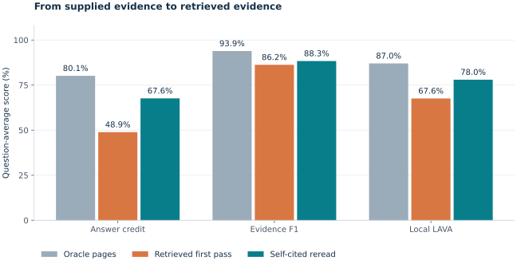

# LAVA — Multilingual Document Intelligence on AWS

[](https://github.com/alvaromendizabal/lava-aws-multilingual-docvqa/actions/workflows/ci.yml)

**Applied ML research system · Python · Open vision-language models · AWS**

Given a question and a complete PDF, this system retrieves evidence pages, reads their images and native text, and returns a structured answer with physical-page citations. I built and evaluated the full pipeline, compared three reader configurations, audited 1,582 retrieval configurations, and tested a targeted second read using the model’s own citations.

The strongest engineering result: **the same 9B reader improved from 67.57% to 77.99% local LAVA after a citation-guided reread**. Both passes, their costs, and their failures are published. These are development measurements on 16 supplied training questions from five PDFs.

**Project status, September 10, 2026:** the test submission is incomplete, with
619 of 624 structurally complete answers preserved. A bounded recovery run targets
three remaining questions; two others have suspected question/document mismatches.
No complete CSV or Kaggle score is claimed. The broader feature-research gate is
open; the completed lexical grid is one part of that work.

**Start with [Notebook 00](notebooks/00_reproducibility_and_protocol.ipynb), then [Notebook 05](notebooks/05_end_to_end_system_evaluation.ipynb). All six notebooks include executed outputs; review requires no account, installation, or GPU.**



## Measured system behavior

All three conditions use the same pinned Qwen3.5 9B reader and local semantic judge.

| Input condition | Semantic answer credit | Evidence-page F1 | Local LAVA | Valid responses |
| --- | ---: | ---: | ---: | ---: |
| Supplied gold pages · oracle comparison | 80.15% | 93.90% | 87.02% | 16/16 |
| Five BM25-retrieved pages · first pass | 48.90% | 86.25% | 67.57% | 16/16 |
| Reread first-pass citations · two-pass system | **67.65%** | **88.33%** | **77.99%** | **16/16** |

The first pass exposed answer errors even when the required evidence was available. The fixed second-pass rule retains the model’s valid cited pages in physical order; empty or invalid citations retain the original input. The final answer is always the second output. Reference answers and gold pages never choose a question’s final prediction.

This reduces page presentations from 76 to 27 on the second pass and improves the question-average score by **10.42 percentage points**. Three documents improved and two tied; equal-document LAVA rose from 67.00% to 76.16%. It also removes some relevant evidence: complete input-evidence coverage falls from 14/16 to 12/16. The improvement is a **post-hoc development finding**, not independent validation.

The completed GPU jobs used one L40S each and recorded 409 and 355 billable seconds. Together they represent approximately **$1.20 of Training compute** at the dated regional rate, excluding Studio, storage, logs, other attempts and other charges. The two-pass system incurs both passes. [Notebook 05](notebooks/05_end_to_end_system_evaluation.ipynb) includes latency, memory, per-question failures, document comparisons and provenance.

## Research decisions

### Compare reader configurations before scaling up

Each reader received the correct evidence pages and their native text:

| Oracle reader | Semantic answer credit | Evidence-page F1 | Local LAVA | Valid responses |
| --- | ---: | ---: | ---: | ---: |
| Qwen3.5 4B · BF16 | 50.62% | 97.02% | 73.82% | 16/16 |
| Qwen3.5 9B · BF16 | **80.15%** | 93.90% | **87.02%** | 16/16 |
| Qwen3.8 27B · NF4 | 70.98% | 89.73% | 80.36% | 15/16 |

9B had the highest local score among the tested configurations. The 27B invalid response remains a counted failure. Hardware, model generation and precision differ, so this comparison does not isolate parameter count. [Notebook 03](notebooks/03_model_scaling_and_cost.ipynb) examines quality, document effects and cost.

### Search broadly, select within document folds

The executable retrieval audit generates **1,089 BM25 scoring configurations** across 11 text views and 99 parameter pairs, plus **493 fusion and exploration policies**. Across both stages, **1,390 ranking signatures are unique and 192 are duplicates**. These are alternative retrieval configurations, not thousands of inputs to a trained model.

Rankings are saved before reference labels are scored. Deduplication and candidate selection within each outer document fold use only the other four documents. Free BM25 selection reduced recall@5 to 89.06%. A conservative multi-document improvement gate retained the original baseline in all five folds. **No lexical challenger earned promotion.** The complete audit took 10.973 seconds on the existing CPU host; a separate resumed process reused all 12 families in 1.783 seconds.

| Retrieval policy over all 74 training-PDF pages | Evidence recall@5 | Questions with all evidence |
| --- | ---: | ---: |
| Fixed BM25 | **95.31%** | **14/16** |
| colSmol-500M page-image retrieval | 57.81% | 8/16 |
| Equal-weight reciprocal rank fusion | 92.19% | 13/16 |
| Four BM25 pages + one novel visual page | 98.44% | 15/16 |

The visual hybrid recovered one additional question on the development pilot. It has no independent validation and is not the default retriever. BM25 reaches complete evidence for all 16 questions at ten pages; that does not establish perfect answering. [Notebook 04](notebooks/04_evidence_retrieval.ipynb) includes ranking curves, feature families, fold decisions, negative results and actual recovery receipts.

### Test document structure as well as lexical parameters

A separate CPU audit evaluates **17 fixed policies across seven document-feature
families**: body text, headings, local text blocks, detected tables, exact numeric
matches, query-term coverage and neighboring pages. It includes each family alone,
the combined policy, each leave-one-family-out ablation, and one query-complement
selector. All rankings cover every physical page and are saved before label scoring.

| Development policy | Evidence recall@5 | Questions with all evidence |
| --- | ---: | ---: |
| Fixed BM25 | 95.31% | 14/16 |
| BM25 plus local-block retrieval | 96.88% | 15/16 |
| All seven document signals | 95.31% | 14/16 |

The block signal completes the sole Vietnamese training example. The improvement
is concentrated in one document, and the existing conservative selector retains
BM25 in all five held-out-document folds. No challenger is promoted. The audit
took 30.235 seconds on the existing CPU host; a separate process reused all five
document and 16 query checkpoints in 0.048 seconds. These are retrieval diagnostics,
not new answer-quality or Kaggle scores. The [research coverage table](docs/retrieval.md#feature-research-completion-gate)
identifies the remaining untested families and validation requirements.

## Review the implementation

| Notebook | What it demonstrates |
| --- | --- |
| [00 — Research overview](notebooks/00_reproducibility_and_protocol.ipynb) | Verified scope, headline results and conclusions |
| [01 — Experiment design](notebooks/01_oracle_reader_benchmark_design.ipynb) | Comparable inputs, model configurations and evaluation boundaries |
| [02 — Cloud execution](notebooks/02_verified_gpu_execution.ipynb) | Actual jobs, checksums, checkpoints, logging and recovery |
| [03 — Model quality and cost](notebooks/03_model_scaling_and_cost.ipynb) | Oracle reader comparison, uncertainty and resource use |
| [04 — Evidence retrieval](notebooks/04_evidence_retrieval.ipynb) | Full-PDF search, 1,582 candidates, document folds and visual retrieval |
| [05 — Complete system](notebooks/05_end_to_end_system_evaluation.ipynb) | Measured retrieved-page answering and citation-guided rereading |

- **Reliable execution:** deterministic SageMaker job names, bounded attempts, per-question S3 checkpoints, independent output parsing, UTC stage logs and heartbeats.
- **Reproducibility:** immutable model/data/prompt contracts, a frozen judge, checksum-verified artifacts, and source/input/output manifests for every notebook.
- **Engineering quality:** unit tests, real-kernel integration tests, corruption and interruption tests, types, lint, formatting, and a required CI quality gate.
- **Readable evidence:** static notebook figures and a [downloadable Plotly report](reports/system/index.html) with static fallbacks. The report can be opened locally; GitHub previews its source.

## Scope and limitations

The data audit verified **208 files, including 205 PDFs**. All labeled evaluation uses **16 training questions from five PDFs: 15 Japanese questions and one Vietnamese question**. Those PDFs were examined during development. Fold isolation reduces selection leakage; it does not turn this pilot into an independent test set.

The [published LAVA metric](https://lava-workshop.github.io/#evaluation) averages semantic answer credit and evidence-page F1 per question. This implementation uses a pinned Gemma-3 1B judge that passed 28 development controls. The organizer’s exact prompt/runtime is unpublished, so **these are local formula-based scores, not official server scores**.

The repository contains an evaluated research system; feature research and the
624-question competition entry remain active completion criteria. Existing results
do not establish held-out, language-wide or state-of-the-art performance. No Kaggle
submission or leaderboard rank is claimed. Application hosting is not required.

## Reproduce and inspect

Use Python 3.12 and the frozen `uv` environment. Register the kernel once:

```bash
uv sync --frozen --group judge
uv run --frozen python -m ipykernel install --user --name lava --display-name "Python (LAVA)"
make notebooks
make quality
```

These commands verify or refresh the public analysis and create no GPU job. Reading the saved notebooks needs none of these steps. In the configured Studio environment, the canonical checkout is `/home/sagemaker-user/lava-aws-multilingual-docvqa`.

Private documents, exact generations and model/judge checkpoints remain in S3. Git contains source, sanitized metrics and executed notebooks. GPU operations require explicit charge acknowledgment; compatible completed work is reused.

[Architecture](docs/architecture.md) · [Evaluation](docs/evaluation.md) · [Retrieval research](docs/retrieval.md) · [System reproduction](docs/system_evaluation.md) · [Verified closeout](docs/closeout.md)
