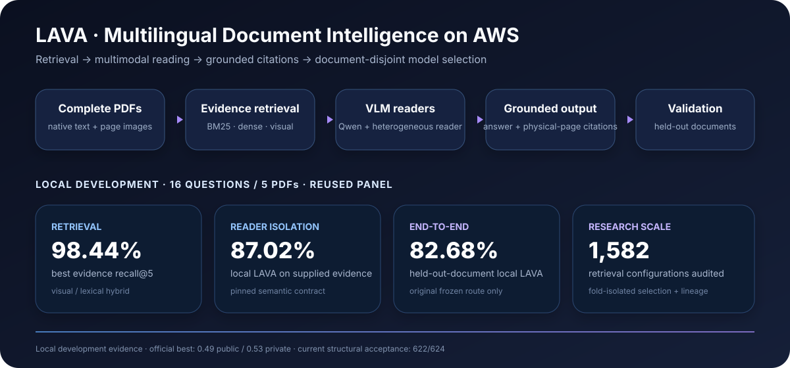
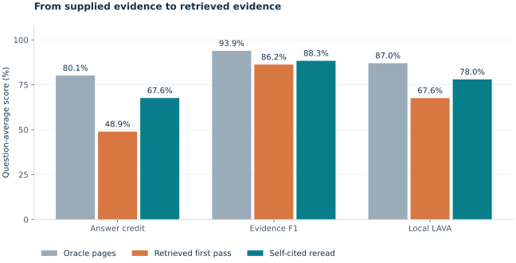
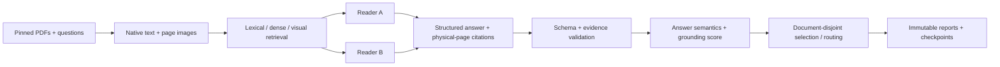

# LAVA — Multilingual Document Intelligence on AWS

[](https://github.com/alvaromendizabal/lava-aws-multilingual-docvqa/actions/workflows/ci.yml)

**Multimodal document AI · Retrieval/RAG · Vision-language reasoning · AWS GPU systems · Reproducible evaluation**

LAVA is an **Applied ML research system** for end-to-end multilingual PDF question answering. It retrieves evidence from complete documents, reads page images and native text with vision-language models, produces structured answers with physical-page citations, validates those citations, and evaluates answer semantics and grounding together.

The project is built like a production ML system rather than a notebook-only experiment: immutable model/data contracts, document-disjoint validation, resumable GPU inference, per-question checkpoints, exact artifact hashing, explicit promotion gates, and public-safe research evidence are first-class parts of the design.

**Portfolio highlights**
- **82.68% document-disjoint local LAVA** for a validated heterogeneous routed system, versus **77.99%** for the prior two-pass incumbent.
- **87.02% local LAVA** for the strongest verified reader on supplied gold evidence.
- **98.44% evidence recall@5** from the strongest measured visual/lexical retrieval hybrid on the development panel.
- **1,582 retrieval configurations** audited with fold-isolated selection and duplicate-signature accounting.
- Multiple negative research branches were explicitly killed when they failed promotion gates, including larger-reader, self-consistency, active-perception, and exhaustive-screening variants.

> These are local development measurements under a pinned implementation of the published LAVA scoring structure. The organizer's exact evaluation runtime is not public, so official competition evaluation remains separate from the measurements reported here.

**Employer review path:** [30-second case study](docs/case_study.md) → [5-minute reviewer guide](docs/reviewer_guide.md) → [Portfolio overview](docs/portfolio.md) → [Notebook 00](notebooks/00_reproducibility_and_protocol.ipynb) → [Notebook 05](notebooks/05_end_to_end_system_evaluation.ipynb)





## What I built

The system separates retrieval, multimodal reading, evidence validation, semantic scoring, and experiment selection so each stage can be measured independently.


```mermaid
flowchart LR
    P["Pinned PDFs + questions"] --> X["Native text + page images"]
    X --> R["Lexical / dense / visual retrieval"]
    R --> Q["Reader A"]
    R --> H["Reader B"]
    Q --> C["Structured answer + physical-page citations"]
    H --> C
    C --> V["Schema + evidence validation"]
    V --> E["Answer semantics + grounding score"]
    E --> S["Document-disjoint selection / routing"]
    S --> A["Immutable reports + checkpoints"]
```

The public repository intentionally publishes the research contract and aggregate evidence without exposing private questions, raw generations, test predictions, exact internal routing rules, credentials, or cloud object locations.

## Measured system behavior

All figures below use the same frozen 16-question development panel from five supplied PDFs and the same pinned semantic-judge contract.

| System | Validation view | Semantic answer | Evidence F1 | Local LAVA |
| --- | --- | ---: | ---: | ---: |
| Qwen3.5-9B on supplied gold evidence | reader-isolation diagnostic | 80.15% | 93.90% | **87.02%** |
| BM25 → Qwen3.5-9B | complete first pass | 48.90% | 86.25% | 67.57% |
| Citation-guided Qwen3.5-9B reread | complete two-pass system | 67.65% | 88.33% | **77.99%** |
| Heterogeneous routed system | nested leave-one-document-out | — | — | **82.68%** |

The two-pass Qwen system improved the first-pass question average by **10.42 percentage points** while using the same 9B reader. That reread result is a **post-hoc development finding** on the reused supplied panel, so the later heterogeneous candidate was evaluated with a stronger nested held-out-document protocol: the candidate family was frozen before each held-out document was scored, and selection used only the other documents. The resulting out-of-fold estimate improved the prior incumbent by **4.69 percentage points**, with two documents improving and none regressing.

The exact competition-specific routing rule is intentionally not published. The public evidence is the validation design, aggregate result, and model-family provenance.

## Verified reader benchmark

The canonical supplied-evidence benchmark keeps all reader configurations visible in the public entrance, including configurations that were not selected. This is the exact model-comparison snapshot represented in the executed notebooks.

| Oracle reader | Semantic answer credit | Evidence-page F1 | Local LAVA | Valid responses |
| --- | ---: | ---: | ---: | ---: |
| Qwen3.5 4B · BF16 | 50.62% | 97.02% | 73.82% | 16/16 |
| Qwen3.5 9B · BF16 | **80.15%** | 93.90% | **87.02%** | 16/16 |
| Qwen3.8 27B · NF4 | 70.98% | 89.73% | 80.36% | 15/16 |

These measurements isolate reader behavior on supplied evidence. They complement—but do not replace—the later retrieved-evidence and document-disjoint system validation.

## Retrieval research

The retrieval program independently evaluates lexical, multilingual dense, and page-image evidence discovery.

| Retrieval policy | Evidence recall@5 | Questions with all evidence |
| --- | ---: | ---: |
| Fixed BM25 | 95.31% | 14/16 |
| multilingual E5 | 92.19% | 13/16 |
| ColQwen visual retrieval | **98.44%** | **15/16** |
| BM25 + visual fusion | **98.44%** | **15/16** |
| BM25 at 10 pages | 100.00% | 16/16 |

The broader lexical audit generates **1,089 BM25 configurations** across 11 text views and 99 parameter pairs, plus **493 fusion/exploration policies**. Rankings are materialized before labels are scored, and fold-isolated selection prevents a global pooled result from silently becoming the promoted retriever.

The result is deliberately conservative: strong exploratory gains are recorded, but only policies that survive the multi-document promotion contract become defaults.

## Reader and reasoning research

### Model scaling

The reader program compared multiple open multimodal model configurations under a common evaluation contract. The strongest verified supplied-evidence reader remains Qwen3.5-9B at **87.02% local LAVA**.

A substantially larger one-shot reader branch was rejected after controlled semantic rescoring. This is an important engineering result: the project does not equate parameter count with system quality, and it stops expensive branches when the measured evidence does not support promotion.

### Self-consistency and active perception

A later Qwen9B experiment tested repeated sampling and targeted crop/zoom views. The best arm improved over its same-run single-reader control but did not satisfy the project promotion gate across documents, so the branch was stopped rather than micro-tuned.

### Exhaustive evidence screening and explicit reasoning

An exhaustive page-screening study showed that more retrieval was not automatically better: extra pages often diluted grounding. Its explicit reasoning arm did, however, achieve perfect local answer and grounding scores on all four numeric development questions, revealing a useful specialization signal without justifying a global system replacement.

### Heterogeneous reader ensemble

A compressed Gemma 4 12B reader produced a different error profile from Qwen. It did not earn standalone promotion, but it was materially complementary. That complementarity motivated a predeclared routed candidate family, which was then evaluated using nested held-out-document selection.

The result—**82.68% out-of-fold local LAVA**—is the strongest independently selected end-to-end development estimate currently published for this project.

See [Frontier research update](docs/frontier_research_update.md) for the aggregate experiment history and [machine-readable evidence](research/README.md) for public-safe result files.

## Engineering quality

This repository emphasizes the parts of ML work that usually disappear from a model-comparison notebook:

- **Deterministic lineage:** pinned model revisions, source hashes, input hashes, prompt/evaluation contracts, and immutable report identities.
- **Resumable inference:** per-question checkpoints and content-addressed artifacts preserve valid work across interrupted GPU runs.
- **Cloud reliability:** deterministic job identities, bounded attempts, explicit cost gates, heartbeats, resource telemetry, failure packaging, and process cleanup.
- **Validation discipline:** document-disjoint selection, negative results kept in the record, and promotion thresholds defined before deployment.
- **Data integrity:** 208 raw files and 205 PDFs audited; citations are checked against physical page bounds.
- **Publication hygiene:** private source documents, raw generations, private test outputs, credentials, and competition-specific orchestration remain outside Git.
- **Software quality:** unit tests, integration tests, Ruff, mypy, notebook integrity checks, and CI.

## Repository map

| Path | Purpose |
| --- | --- |
| [`notebooks/`](notebooks/) | Six executed, checksum-bound research notebooks |
| [`src/lava/`](src/lava/) | Retrieval, reader, evaluation, schema, and checkpointing code |
| [`scripts/`](scripts/) | Reproducible research and operator commands |
| [`pipelines/`](pipelines/) | Bounded batch-inference entry points |
| [`configs/`](configs/) | Frozen model, retrieval, evaluation, and system contracts |
| [`reports/`](reports/) | Sanitized measured results and figures |
| [`research/`](research/) | Public-safe aggregate frontier evidence |
| [`docs/`](docs/) | Architecture, evaluation, reviewer guide, research decisions, and reproduction notes |

## Canonical executed notebooks

The six canonical notebooks remain the checksum-bound executed evidence for the benchmark state. Later frontier research is published separately rather than rewriting saved outputs without a legitimate rerun.

| Notebook | What it demonstrates |
| --- | --- |
| [00 — Research overview](notebooks/00_reproducibility_and_protocol.ipynb) | Verified scope, evaluation contract, benchmark results, and conclusions |
| [01 — Experiment design](notebooks/01_oracle_reader_benchmark_design.ipynb) | Comparable reader inputs, model configurations, and evaluation boundaries |
| [02 — Cloud execution](notebooks/02_verified_gpu_execution.ipynb) | AWS jobs, checksums, checkpoints, logging, and recovery |
| [03 — Model quality and cost](notebooks/03_model_scaling_and_cost.ipynb) | Reader comparison, uncertainty, latency, memory, and resource tradeoffs |
| [04 — Evidence retrieval](notebooks/04_evidence_retrieval.ipynb) | Full-PDF retrieval, feature research, visual retrieval, and fold decisions |
| [05 — Complete system](notebooks/05_end_to_end_system_evaluation.ipynb) | Retrieved-evidence answering and citation-guided rereading |

## Review path for employers

**30-second review**
1. [Engineering case study](docs/case_study.md)
2. Scan the executive system overview above.

**5-minute review**
1. [Employer review guide](docs/reviewer_guide.md)
2. [Portfolio overview](docs/portfolio.md)
3. [Notebook 00 — Research overview](notebooks/00_reproducibility_and_protocol.ipynb)

**15-minute technical review**
1. [Notebook 05 — Complete system](notebooks/05_end_to_end_system_evaluation.ipynb)
2. [Notebook 04 — Evidence retrieval](notebooks/04_evidence_retrieval.ipynb)
3. [Frontier research update](docs/frontier_research_update.md)
4. [Architecture and lineage](docs/architecture.md)
5. [Reproducibility guide](docs/reproducibility.md)

## Scope and limitations

The canonical notebooks are executed evidence for the benchmark state they actually ran and remain checksum-bound to their source and declared inputs. Later research is published as aggregate evidence rather than retroactively rewriting those notebook outputs.

The labeled development set is small: 16 questions from five supplied PDFs, with limited Vietnamese coverage. The metric follows the published LAVA structure under a pinned local semantic judge. These measurements support research decisions; they are **not presented as organizer-server-identical competition scores**.

The private full-test and competition layer is intentionally excluded from public Git. Public claims are limited to aggregate development evidence, reusable engineering, and validation methodology. Private test predictions, exact routing logic, raw private generations, credentials, cloud object locations, model caches, and return bundles are not published.

For the exact public/private boundary and reproduction levels, see [Reproducibility](docs/reproducibility.md).

## Reproduce and inspect

Public review requires no account or GPU. For environment-backed verification, use Python 3.12 and the frozen `uv` environment:

```bash
uv sync --frozen --group judge
make quality
make notebooks
```

For model-backed evaluation, run the non-destructive prerequisite checks first:

```bash
make evaluation-check
make evaluation-preview
```

The public workflow is intentionally layered: executed evidence can be inspected immediately, CPU checks are reproducible from Git, model evaluation requires access to the pinned open checkpoints, and private competition inference remains outside the public repository.

[Engineering case study](docs/case_study.md) · [Employer review guide](docs/reviewer_guide.md) · [Portfolio overview](docs/portfolio.md) · [Reproducibility](docs/reproducibility.md) · [Architecture](docs/architecture.md) · [Evaluation](docs/evaluation.md) · [Retrieval research](docs/retrieval.md) · [Frontier research](docs/frontier_research_update.md)