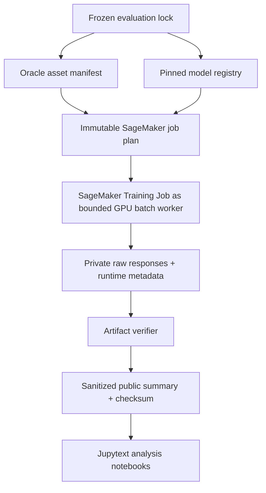

# Architecture and experiment lineage

LAVA separates the experiment into four independently testable layers: protocol, evidence preparation, reader execution, and public evaluation.

## Hardware policy

Hardware is selected by model requirements, not by whichever quota happens to be visible.

- `qwen35_4b_fused_direct` → `ml.g5.2xlarge` (verified baseline).
- `qwen35_9b_fused_direct` → `ml.g6e.2xlarge` (verified LAVA run).
- `qwen38_27b_fused_direct` → `ml.g7e.12xlarge` because the frozen contract requires at least 80 GiB of CUDA memory on one device.

`tests/unit/test_hardware_contract.py` prevents accidental drift in these mappings.

## Failure model

A SageMaker job reaching `Completed` is necessary but not sufficient. A result is accepted only after the artifact gate verifies the expected output prefix, raw-response count, structured-output schema validity, parser errors, and lineage. Public synchronization re-runs verification before writing sanitized summaries into `reports/`.

## Reproducibility boundary

Private benchmark content remains in versioned S3 objects. Git stores only code, immutable lock metadata, sanitized public aggregates, checksums, and analysis notebooks. This keeps the portfolio inspectable without publishing private evaluation material.
