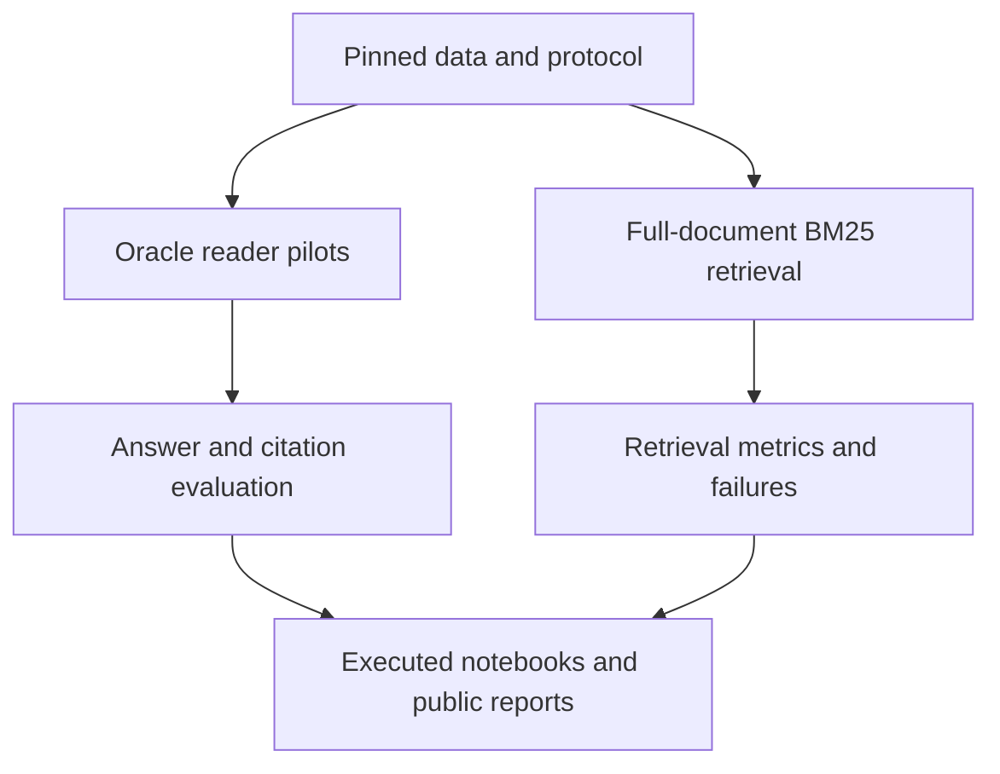

# Architecture and experiment lineage

LAVA separates data/protocol, reader execution, retrieval, and evaluation so each can be verified independently.

## Completed components

The data audit verified 208 raw files and all 205 PDFs. Reader pilots ran on all 16 training questions; retrieval searched all 74 training-PDF pages. Reader and retrieval performance are measured independently in this completed component benchmark.

| Compared configuration | Verified instance |
| --- | --- |
| Qwen3.5 4B fused direct | `ml.g5.2xlarge` |
| Qwen3.5 9B fused direct | `ml.g6e.2xlarge` |
| Qwen3.8 27B NF4 fused direct | `ml.g5.2xlarge` |

The immutable registry also retains unused historical candidates. Their presence does not require running them. Notebook 01 shows only the three completed configurations.

## Verification and durability

A cloud job reaching Completed is not sufficient evidence of a valid result. Artifact verification checks lineage, scope, raw generations, structured responses, checkpoints, and independently derived metrics. Model failures remain visible in the evaluation denominator.

Private documents, responses, and checkpoints remain in S3. Public Git history contains implementation, pinned contracts, sanitized aggregates, and executed notebooks. UTC events, elapsed time, heartbeats, checksum verification, and resume tests are part of the implementation.

## One notebook interface

All five notebooks live directly in `notebooks/`. Each includes verified outputs and runs independently against public results. Manifests in `reports/notebook_execution/` bind source, inputs, and outputs. Completed staging records support recovery from interrupted publication.

The active Studio checkout is `/home/sagemaker-user/lava-aws-multilingual-docvqa`. Historical validation checkouts and installation bundles have been archived and removed. Empty app, serving, agent, and infrastructure scaffolding has been removed; those capabilities are not represented as implemented.

See [scope and limitations](../README.md#scope-and-limitations). Integrated reader/retrieval evaluation, deployment, and submission are optional extensions; no end-to-end score is claimed.
