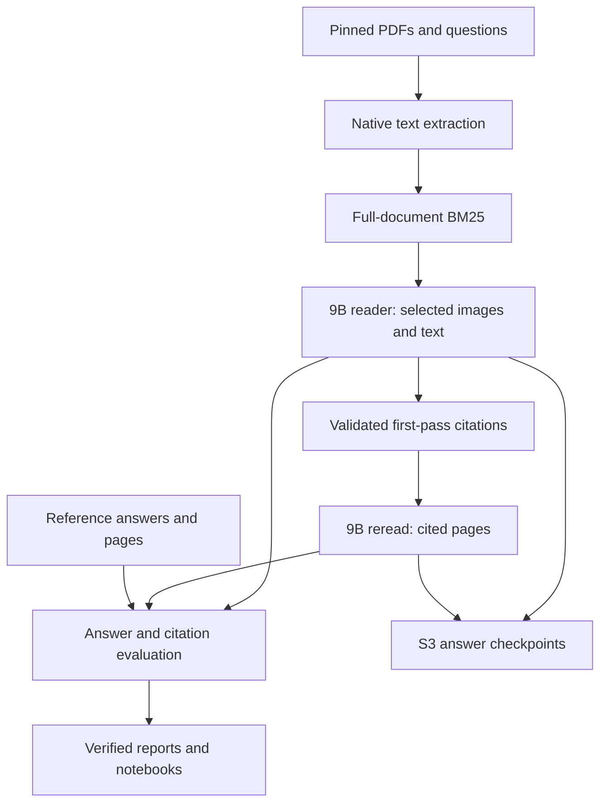

# Architecture and experiment lineage

LAVA separates label-free inference from reference-based evaluation. The deployed cloud workloads are managed batch inference jobs; model weights are frozen.

Reference answers and evidence pages enter evaluation only. The first pass ranks all physical pages of the question’s PDF, presents up to five pages, and validates that citations belong to the supplied input. The second pass retains valid self-cited pages, falling back to the original set when necessary. It always returns the second answer; no label-based per-question selection is performed.

## Completed experiments

The audit verified 208 raw files and all 205 PDFs. Oracle reader pilots covered all 16 training questions; retrieval searched all 74 pages of their five PDFs. Integrated first-pass and second-pass answers were subsequently generated and scored on those same questions.

| Configuration | Verified instance | Role |
| --- | --- | --- |
| Qwen3.5 4B BF16 | `ml.g5.2xlarge` | Oracle reader comparison |
| Qwen3.5 9B BF16 | `ml.g6e.2xlarge` | Oracle reader comparison |
| Qwen3.8 27B NF4 | `ml.g5.2xlarge` | Quantized larger-reader comparison |
| Qwen3.5 9B BF16 | `ml.g6e.8xlarge` | Retrieved-page first pass and citation-guided reread |
| colSmol-500M | `ml.m7i.2xlarge` | Exploratory page-image retrieval |

The successful integrated attempts used an available larger host with the same single L40S GPU class and reader configuration. The model registry retains historical candidates for lineage; they are not unfinished experiments.

## Feature research

The lexical audit caches token statistics, checkpoints 11 BM25 families and one fusion/exploration family, and records all 1,582 candidate rankings before scoring. Candidate signatures used for selection contain only the four training documents in each outer fold. Global duplicate counts and pooled family scores are descriptive. The conservative gate requires improvement across multiple training documents; the fixed BM25 baseline survived every fold.

## Verification and durability

A Completed job is followed by artifact verification: source lineage, complete unique question coverage, exact generation checksums, independently parsed citations, and the common semantic judge. Invalid model outputs remain in the denominator.

Private documents, page images, generations and judge decisions remain in S3. Conditional writes and read-back checks protect checkpoints. Deterministic job names allow reattachment after monitor interruption; failed or stopped attempts require an explicit retry. UTC events report stage and total elapsed time, progress and heartbeats.

All six notebooks live directly in `notebooks/`. Manifests in `reports/notebook_execution/` bind executable source, public inputs and completed outputs. Successful staging records recover interrupted publication; a failed execution preserves the previous publication.

The canonical Studio checkout is `/home/sagemaker-user/lava-aws-multilingual-docvqa`. Source lives in `src/lava/`, operator commands in `scripts/`, frozen settings in `configs/`, and batch entry points in `pipelines/`. No endpoint or application service is required to review the release.

[Measured results and limitations](../README.md#scope-and-limitations) · [System operation](system_evaluation.md)
