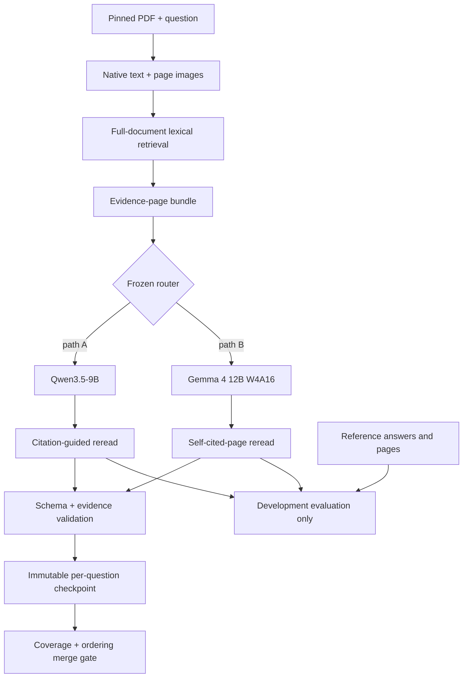

# Architecture and experiment lineage

LAVA is organized as a **retrieval → multimodal reading → validation → checkpointing** system. Reference answers are isolated from inference, model and representation identities are pinned, and long-running GPU work is resumable at question granularity.

## Current system

```mermaid
flowchart TD
    A["Pinned PDF + question"] --> B["Native text + page images"]
    B --> C["Full-document lexical retrieval"]
    C --> D["Evidence-page bundle"]
    D --> R{"Frozen router"}
    R -->|path A| Q["Qwen3.5-9B"]
    Q --> QR["Citation-guided reread"]
    R -->|path B| G["Gemma 4 12B W4A16"]
    G --> GR["Self-cited-page reread"]
    QR --> V["Schema + evidence validation"]
    GR --> V
    V --> K["Immutable per-question checkpoint"]
    K --> M["Coverage + ordering merge gate"]
    REF["Reference answers and pages"] --> E["Development evaluation only"]
    QR --> E
    GR --> E
```

The router is frozen before test inference. It does not inspect private answers or gold evidence. The public repository documents the routing experiment and aggregate validation result while intentionally withholding the turnkey competition policy.

## Baseline lineage

The original complete system used:

1. full-document BM25 retrieval;
2. up to five selected physical pages;
3. a pinned Qwen3.5-9B multimodal reader;
4. structured answer + physical-page citations;
5. a fixed second pass over the reader's own valid citations.

Reference answers and evidence pages enter only after inference. The second pass always returns the second answer; labels never choose a per-question prediction.

That baseline measures **77.99% local LAVA** on the supplied development panel.

## Heterogeneous routed system

Later experiments showed complementary reader behavior rather than a universal single-model winner. A compressed Gemma 4 multimodal reader was therefore evaluated alongside the Qwen baseline.

A compact prespecified routing family was selected in nested held-out-document folds. The validated routed challenger measures **82.68% local LAVA**, improving two held-out documents and regressing none relative to the 77.99% baseline.

See [validated heterogeneous routing](heterogeneous_routing_update.md) for the public-safe methodology and systems details.

## Representation contracts

Vision-language inference treats preprocessing as part of model identity.

Page representations bind:

- source PDF checksum/version;
- physical page number;
- rasterization procedure;
- image checksum;
- extracted text checksum;
- model/processor revision.

For later multimodal work, the historical reread renderer was recovered from the exact successful experiment source and reproduced byte-for-byte before being reused on new documents. This prevents silent image-pipeline drift from masquerading as model change.

## Reader execution

Qwen and Gemma execute in separate phases on the single-GPU workflow so their weights are never resident simultaneously.

### Qwen path

The Qwen reader uses deterministic generation and a second read over validated first-pass citations. Per-question checkpoints allow the pipeline to resume without repeating completed inference.

For isolated requests that exceeded the L4 memory envelope, the system used the same BF16 checkpoint and prompt with Accelerate-managed GPU/CPU weight placement. The offloaded path was permitted only after byte-identical raw-generation parity on difficult already-completed questions.

### Gemma path

Gemma 4 W4A16 runs through a pinned vLLM environment. Before increasing batching, the pipeline compared real routed prompts at batch sizes 1, 2, and 3 and required byte-identical greedy outputs for both direct and self-citation passes.

Batch 3 passed the parity gate and delivered substantially better measured throughput.

## Durable inference

Every completed question is a separate immutable checkpoint. A compatible rerun verifies and reuses completed work before constructing model weights.

Checkpoint and run contracts bind:

- source revision;
- data manifest;
- model revision;
- page representation;
- prompt/schema contract;
- routing contract;
- inference implementation;
- parent-run lineage.

A final candidate is blocked unless coverage, unique IDs, ordering, answer serialization, citations, and physical page bounds all validate.

## Process lifecycle and recovery

The execution layer emits UTC events and heartbeats with:

- stage and progress counts;
- elapsed time;
- GPU memory/utilization;
- process RSS and host RAM;
- disk headroom;
- checkpoint reuse/new counts;
- estimated compute spend.

A failure in one stage packages diagnostics and exits nonzero rather than silently continuing.

GPU child workers execute in isolated process groups. Timeout handling terminates the entire worker tree, including inference-engine descendants. Stale GPU-process cleanup is fail-closed and requires provenance linking the process to a recorded project run.

## Completed research families

The project has evaluated:

| Family | Role |
| --- | --- |
| BM25 lexical retrieval | durable baseline |
| multilingual dense retrieval | retrieval challenger |
| page-image retrieval | visual evidence discovery |
| lexical + visual fusion | hybrid retrieval |
| Qwen3.5 4B / 9B | reader scaling |
| larger quantized Qwen variants | controlled scaling / negative result |
| citation-guided reread | baseline refinement |
| self-consistency | reader robustness study |
| targeted crop/zoom perception | active-perception study |
| exhaustive page screening | high-recall retrieval study |
| explicit numerical/table reasoning | specialist reasoning study |
| Gemma 4 W4A16 | heterogeneous reader |
| document-disjoint model routing | validated system challenger |

The repository keeps negative results because branch-kill decisions are part of disciplined ML development.

## Reproducibility boundary

Public Git contains source, aggregate metrics, contracts, reports, and executed notebooks sufficient to review the engineering and research decisions.

Private storage retains:
- source documents where redistribution is inappropriate;
- test questions/answers;
- raw generations;
- private evaluation decisions;
- test predictions;
- credentials and cloud object locations;
- exact competition orchestration.

The canonical Studio checkout is:

`/home/sagemaker-user/lava-aws-multilingual-docvqa`

Source lives in `src/lava/`, operator commands in `scripts/`, frozen settings in `configs/`, and batch entry points in `pipelines/`.

[Measured results](../README.md) · [Validated routing](heterogeneous_routing_update.md) · [System evaluation](system_evaluation.md)
