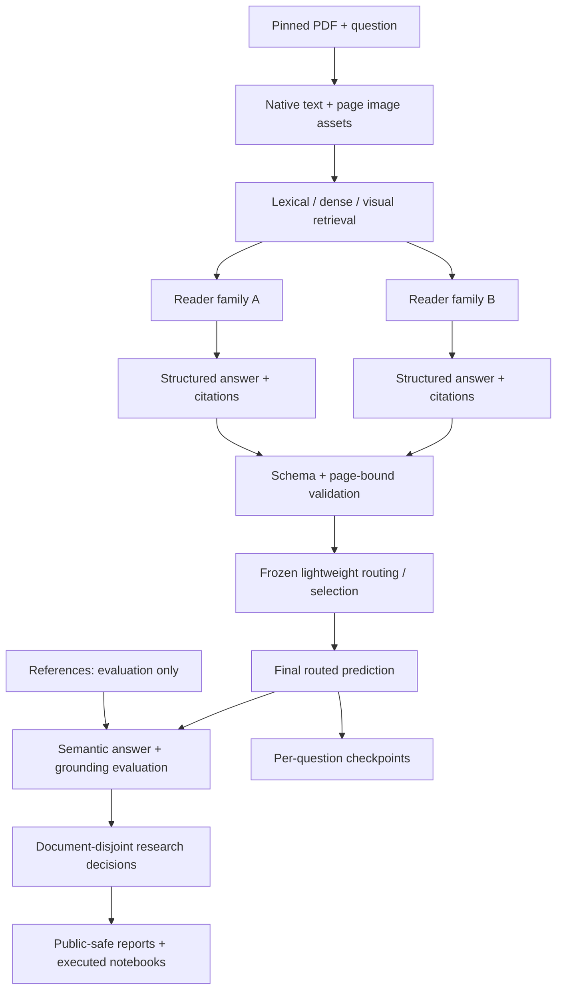

# Architecture and experiment lineage

LAVA separates label-free inference, model specialization, and reference-based evaluation. The private cloud workflow is a resumable batch system; the public repository contains the reusable architecture and sanitized evidence.

```mermaid
flowchart TD
    P["Pinned PDF + question"] --> X["Native text + page image assets"]
    X --> R["Lexical / dense / visual retrieval"]
    R --> A["Reader family A"]
    R --> B["Reader family B"]
    A --> SA["Structured answer + citations"]
    B --> SB["Structured answer + citations"]
    SA --> V["Schema + page-bound validation"]
    SB --> V
    V --> H["Frozen lightweight routing / selection"]
    H --> O["Final routed prediction"]
    G["References: evaluation only"] --> E["Semantic answer + grounding evaluation"]
    O --> E
    E --> D["Document-disjoint research decisions"]
    O --> K["Per-question checkpoints"]
    D --> N["Public-safe reports + executed notebooks"]
```

The exact private routing rule is intentionally not published. The public contract exposes model families, aggregate measurements, held-out-document validation, and promotion logic.

## Completed research layers

### Data and representation
- audited 208 raw files including all 205 PDFs;
- physical-page identities retained throughout the pipeline;
- native text and rendered page assets checksum-bound;
- evidence citations validated against supplied physical pages.

### Retrieval
The system evaluates lexical BM25, multilingual dense retrieval, page-image late interaction, and visual/lexical fusion. The public retrieval audit materializes rankings before label scoring and uses document-fold isolation for candidate selection.

### Reader systems
The project evaluates multiple open multimodal reader families and precision/runtime profiles. The measured incumbent uses a two-pass citation-guided reread: a first prediction proposes evidence pages, then the same reader rereads only its valid citations with a deterministic fallback.

A later heterogeneous-reader study adds a deliberately different compressed multimodal model. It is not promoted on standalone score; its complementary error profile motivates a routed candidate family.

### Validation
The routed candidate is evaluated with nested leave-one-document-out selection. For each outer fold, the candidate family is frozen and the selected policy is learned only from the remaining documents. The held-out document contributes exactly once to the aggregate.

This produces a **82.68% out-of-fold local LAVA** development estimate versus **77.99%** for the prior two-pass incumbent.

## Reliability architecture

The private AWS workflow treats inference as a durable data pipeline rather than a single model call:

- deterministic run and contract identities;
- per-question checkpoints;
- content-addressed assets;
- exact read-back verification;
- bounded runtime and cost controls;
- periodic heartbeats and resource telemetry;
- explicit failure classes;
- process isolation and cleanup;
- resume without regenerating completed questions;
- strict final coverage/schema/evidence gates.

A failed or stopped run preserves completed work. Changes to model revision, source contract, prompt implementation, or representation identity invalidate incompatible checkpoints instead of silently reusing them.

## Reproducibility boundary

Public: source implementation, frozen public configs, model/judge revisions, aggregate metrics, sanitized receipts, executed notebooks, architecture, and validation contracts.

Private: restricted source documents, private questions/answers, raw generations, test predictions, competition-specific routing details, credentials/private object locations, and model caches.

## Canonical review paths

- `notebooks/` — executed benchmark evidence
- `research/` — later aggregate frontier evidence
- `reports/` — measured sanitized outputs
- `configs/` — frozen contracts
- `src/lava/` — reusable implementation
- `pipelines/` — bounded batch entry points

The canonical Studio checkout is `/home/sagemaker-user/lava-aws-multilingual-docvqa`.

[Portfolio overview](portfolio.md) · [Frontier research](frontier_research_update.md) · [System operation](system_evaluation.md)
