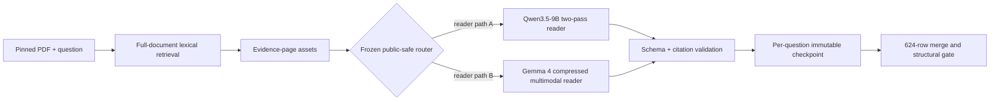

# Validated heterogeneous routing and inference engineering

**Evaluation scope:** local results in this study use a reused 16-question/five-PDF panel. Document holdout within that panel is not independent confirmation on new documents. The original-route score does not apply to the later recovered full-test composite. See the [official results and current completion status](submission_closeout.md).

This update records the strongest public-safe research and systems results produced after the original two-pass Qwen benchmark. It is intentionally **semi-reproducible**: model identities, aggregate measurements, validation design, engineering contracts, and failure-handling principles are public; private questions, raw generations, test predictions, credentials, cloud object names, exact routing thresholds, and competition-specific orchestration remain private.

## Why the system changed

The original end-to-end baseline used one reader family for every question:

```text
PDF → BM25 page retrieval → Qwen3.5-9B → self-cited-page reread → structured answer + evidence
```

That system measured **77.99% local LAVA** on the supplied 16-question development panel. Subsequent experiments showed that the remaining errors were not explained by a simple "use a bigger model" story.

A controlled 27B branch increased infrastructure cost and complexity without beating the pinned 9B reader. Self-consistency and fixed crop/zoom perception also failed the promotion gate. Exhaustive page screening increased context but did not improve the end-to-end system.

The productive signal came from **model complementarity**.

## Complementary readers

A second multimodal reader family, Gemma 4 12B W4A16, was evaluated under the same local LAVA scoring contract. As a standalone retrieved-evidence system it did not replace the Qwen incumbent, but its error pattern was substantially different.

Aggregate development behavior showed:

- strong results on string and numeric questions;
- materially weaker results on unordered lists;
- different residuals from the Qwen system;
- competitive answer quality despite a different model family and compressed inference stack.

Instead of averaging every prediction, the project treated reader choice as a constrained routing problem.

## Leakage-aware routing validation

The routing experiment used a small prespecified policy family derived from answer format and language. Selection was performed inside **nested held-out-document folds** so the held-out document did not choose its own reader policy.

The accepted baseline and the routed challenger were scored under the same pinned local evaluator.

| System | Local LAVA | Held-out documents improved | Held-out documents regressed |
| --- | ---: | ---: | ---: |
| Two-pass Qwen baseline | 77.99% | — | — |
| Heterogeneous routed challenger | **82.68%** | **2** | **0** |

The improvement is **+4.69 percentage points** on the document-disjoint evaluation.

Four of five training folds selected the same compact routing policy. A separate full-panel diagnostic was directionally consistent, but only the held-out-document result is treated as the validation result.

This is still a small development set, not an official hidden-test score. The result is useful because the validation protocol is explicit, frozen, and harder to overfit than a single pooled development measurement.

## System architecture



The production-style inference path is deliberately different from the small-panel research loop:

- route identity is frozen before test inference;
- each question is independently checkpointed;
- completed questions are never regenerated during resume;
- source, model, prompt, renderer, and route contracts are hashed;
- a final CSV is blocked unless every expected row passes structural validation.

## Exact representation provenance

Vision-language results were sensitive to image preparation, so render provenance is treated as part of the model contract.

The successful document reread representation was recovered from its exact historical source and reproduced byte-for-byte. The public implementation contract records the important steps:

- 180-DPI page rasterization;
- 2048-pixel maximum long edge;
- deterministic LANCZOS resize;
- stable PNG serialization;
- normalized native-text extraction.

The engineering lesson is broader than this competition: **preprocessing is model state**. Reproducing architecture and weights is not enough if the page representation silently changes.

## Constrained-GPU inference

The routed system runs on a single NVIDIA L4-class GPU. The Qwen and Gemma readers are never resident together.

The Qwen path exposed a near-boundary memory case on one question. Rather than reducing evidence or silently changing the model, the pipeline:

1. preserved all completed GPU checkpoints;
2. identified only the requests that actually exceeded the memory envelope;
3. released the resident model;
4. used Accelerate weight placement across GPU and host RAM for the exceptional path;
5. required byte-identical raw generations on difficult previously completed questions before allowing the offloaded path to produce a new answer.

That parity gate passed, and the full Qwen routed slice completed without changing the reader contract.

## Throughput without silent numerical drift

The Gemma reader runs through vLLM. Batch size was not increased on assumption.

The pipeline benchmarked batch sizes 1, 2, and 3 on real routed prompts and required **byte-identical greedy outputs** for both direct and self-citation passes before promoting a larger batch.

Batch 3 preserved exact outputs on the benchmark and delivered approximately **6× benchmark throughput versus batch 1**, so it became the execution setting for the resumable full-test phase.

This pattern—measure throughput, require output parity, then promote—is reusable across production inference systems where performance optimizations must not alter deterministic predictions.

## Resumability and process lifecycle

Long-running GPU work is organized around immutable, per-question checkpoints rather than one monolithic job.

The runner records:

- run identity and parent lineage;
- stage progress;
- completed / total / remaining;
- elapsed time;
- GPU memory and utilization;
- host RAM and process RSS;
- disk headroom;
- estimated compute cost;
- model/runtime identity;
- checkpoint reuse counts.

A timeout or browser interruption therefore loses at most the in-flight unit of work.

A later failure exposed an important process-lifecycle edge case: terminating the Python parent did not necessarily terminate the vLLM EngineCore descendant. The runner was hardened to use process groups, bounded nonblocking output polling, and explicit descendant cleanup. Stale GPU-process cleanup is fail-closed and requires provenance tying the process to a recorded project run.

## Failure-driven regression engineering

The project treats infrastructure failures as test cases rather than anecdotes.

Examples converted into regression coverage include:

- stale or differently serialized lineage hashes;
- CPU-only versus CUDA Python environments;
- optional acceleration-library detection;
- multimodal context-window overflow;
- exact rasterization drift;
- constrained-GPU OOM recovery;
- batch-parity validation;
- child-process timeout cleanup;
- stale GPU-worker ownership checks;
- checkpoint collision and resume behavior.

This makes the research workflow increasingly reliable even as experiments move across different runtimes and model families.

## What is public and what is intentionally private

Public:

- architecture and system boundaries;
- model families and pinned revisions where appropriate;
- aggregate metrics;
- validation methodology;
- promotion / kill decisions;
- reproducibility principles;
- runtime engineering patterns;
- negative results.

Private:

- test questions and answers;
- raw model generations;
- private cloud object names;
- credentials;
- final test predictions;
- exact competition routing implementation;
- internal recovery heuristics;
- return bundles and execution receipts.

The goal is to make the repository useful to an ML hiring manager or engineer reviewing system quality without publishing a turnkey competition solution.

## Historical inference state and subsequent closeout

At the time of this study, the Qwen routed slice was fully checkpointed and the Gemma slice remained partially checkpointed. That progress snapshot is superseded by the October 6 closeout.

The recovered candidate contains 622 structurally accepted, non-abstaining predictions and two unresolved answers. Its diagnostic submission used two compatibility abstentions and scored 0.48 public / 0.49 private. The historical best remains 0.49 public / 0.53 private. Neither artifact meets the strict supported-answer completion objective. See the [verified closeout and reproduction boundary](submission_closeout.md).

## Engineering takeaways

This project demonstrates several production-relevant lessons:

1. **Bigger models are not automatically better.** Controlled evaluation can justify retaining a smaller, more reliable reader.
2. **Specialization can outperform monolithic inference.** Complementary model families are valuable when routing is validated without leakage.
3. **Representation provenance matters.** Image preprocessing and text normalization belong in the reproducibility contract.
4. **GPU constraints can be engineered around without silently changing predictions.**
5. **Inference speedups need parity tests, not assumptions.**
6. **Checkpoint design determines whether long experiments are resilient or expensive to restart.**
7. **Failure handling is part of the ML system, not an afterthought.**
