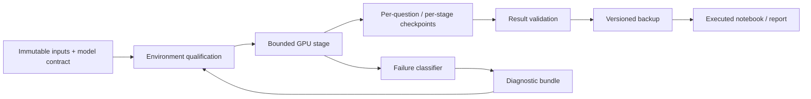

# Reliability and recovery engineering

## Why this exists

Multimodal document systems fail in ways that ordinary model notebooks rarely expose. GPU jobs can outlive terminals, model loaders can stall on storage, notebook kernels can drift from the intended environment, inter-process communication can hit path limits, and a late-stage failure can destroy hours of valid inference if checkpoints are treated as temporary files.

This project treats those failure modes as part of the ML system, not as operator inconvenience.

The reliability layer is designed around one rule:

> **A downstream failure must not invalidate or erase previously verified scientific work.**

That principle shapes checkpointing, runtime qualification, process isolation, notebook publication, and public/private artifact boundaries.

## Reliability architecture

### 1. Immutable scientific identity

Reusable work is keyed by the inputs that make it scientifically meaningful:

- source revision or source hash;
- model ID and pinned revision;
- prompt/inference-policy identity;
- input/data identity;
- runtime contract when material;
- evaluation contract;
- output checksum.

A filename or timestamp is never sufficient provenance by itself.

### 2. Resume-first inference

Long-running inference is checkpointed at the smallest useful unit. Valid completed outputs remain available even when a later question, reader, report, or packaging stage fails.

Checkpoint reuse is allowed only when compatibility checks pass. A retry therefore resumes work rather than silently recomputing the entire experiment.

### 3. Functional runtime qualification

Version strings alone are not enough. The runtime gate checks the capabilities the experiment actually needs, such as:

- CUDA visibility and expected device count;
- compatible Torch / TorchVision binaries;
- model and processor imports;
- structured-output support;
- image preprocessing;
- bounded model loading behavior;
- real local IPC where the runner depends on it.

A runtime can be rejected even when packages import, and accepted even when a support-library patch version differs, as long as the required functional contract is satisfied.

### 4. Bounded failure domains

Expensive stages have explicit ceilings for model loading, generation, memory, storage, and total wall-clock time. Child processes are owned by the runner and cleaned up on timeout.

The system distinguishes implementation failures from scientific negative results:

- **Execution failure:** dependency, runtime, storage, parser, notebook, packaging, or model-execution failure.
- **Valid negative experiment:** the intended experiment completed correctly and failed its promotion threshold.

This distinction prevents infrastructure faults from being misread as evidence against a model hypothesis.

### 5. Independent finalization

Scientific execution, notebook rendering, and backup are separate finalization concerns. A reporting failure must not suppress durable backup, and a backup failure must not rewrite the scientific outcome.

Executed notebooks are saved, reopened, and validated as publication artifacts rather than assumed correct because the kernel exited.

## Failure classes converted into tests

The project has encountered and regression-tested several real operational failure modes:

| Failure class | Engineering response |
| --- | --- |
| Ephemeral runtime/model state | persistent workspace + versioned artifact backup |
| Low persistent-volume headroom | preflight storage gates + bounded cleanup |
| Orphaned model-engine processes | owned-child cleanup and timeout enforcement |
| IPC/socket path limits | short scoped IPC roots + real socket regression tests |
| Runtime/package drift | functional environment qualification |
| Timestamp-only integrity checks | content/hash-based verification |
| Notebook kernel drift | explicit interpreter selection + save/reopen validation |
| Model-loading stalls | operation-level telemetry + bounded loading strategies |
| Late-stage failure after valid inference | per-stage checkpoints + independent backup |

The important pattern is not that failures occurred; it is that each confirmed avoidable failure became a reusable guard or regression test before another expensive run.

## Scientific integrity under failure

Reliability work is deliberately separated from model-quality claims.

The system does **not**:

- treat a runtime crash as a negative model result;
- promote a model because a notebook rendered successfully;
- silently fill unsupported outputs and call them recovered predictions;
- recompute completed private inference merely because a later reporting stage failed;
- compare local development metrics directly with official competition scores.

This separation matters because robust experimentation requires knowing whether an idea failed scientifically or whether the experiment itself failed to execute.

## Public-safe reproducibility

The public repository exposes the reusable engineering mechanisms:

- typed prediction and checkpoint schemas;
- content-addressed artifacts;
- bounded execution and failure classification;
- runtime qualification logic;
- notebook publication checks;
- validation and promotion contracts;
- CI-backed source quality.

The private competition layer remains outside Git:

- private test predictions;
- raw private generations;
- exact competition-specific routing;
- private source mappings;
- credentials and cloud object locations;
- private return bundles and model caches.

This is a deliberate reproducibility boundary: reviewers can inspect and rerun the engineering contract without receiving the competition-sensitive layer.

## How to review the reliability work

Start with:

1. [Reproducibility guide](reproducibility.md)
2. [Architecture](architecture.md)
3. [Notebook 02 — verified GPU execution](../notebooks/02_verified_gpu_execution.ipynb)
4. [Notebook 05 — end-to-end system evaluation](../notebooks/05_end_to_end_system_evaluation.ipynb)
5. [Machine-readable reliability summary](../research/reliability_frontier.json)

The most useful interview discussion is not “how many retries did this take?” It is:

- How is completed GPU work made reusable after interruption?
- What evidence is required before a checkpoint is trusted?
- How are runtime failures separated from model-quality failures?
- What belongs in a public portfolio versus a private competition layer?
- Which reliability controls reduce both cloud cost and scientific ambiguity?

## Bottom line

The project is not only a multilingual VQA model. It is a **recoverable ML system**: model/data lineage, checkpoint reuse, runtime qualification, bounded execution, failure evidence, and publication integrity are designed together.

That systems work is what makes the research credible, repeatable, and operationally realistic.
