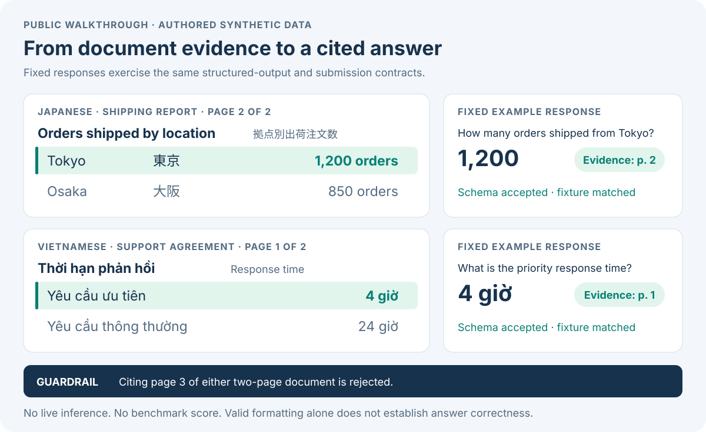

# Try the public validation contracts

Run from the repository root with Python 3.12:

```bash
python3 examples/run_demo.py
```

The command uses only the Python standard library and the repository's existing
parser and submission validator. It needs no installation, account, GPU, download,
or competition data. It prints JSON and writes no files.



| Authored example | Expected answer | Evidence |
|---|---|---|
| Japanese quarterly shipping report: orders shipped from Tokyo | 1,200 | Page 2 |
| Vietnamese support agreement: priority response time | 4 hours (`4 giờ`) | Page 1 |

The [fixture](fixture.json) contains two short synthetic documents, questions,
expected answers, and **fixed reader responses written for this demonstration**.
The SVG renders the same evidence with English labels alongside Japanese text;
Japanese glyphs require a CJK font on the viewing system. These are not competition documents or model
generations. The example demonstrates interface behavior; it does not reproduce
retrieval, live vision-language inference, or a competition score. The fixed
confidence values are illustrative and are not calibrated probabilities.

The script exercises the real
[structured-output parser](../src/lava/readers/structured_output.py) and
[submission validator](../src/lava/evaluation/submission.py):

1. Parse two complete responses with citations restricted to the supplied pages.
2. Validate Unicode CSV serialization, complete question coverage, row order,
   nonempty answers, and page bounds.
3. Reject a citation to page 3 of a two-page document.
4. Show that a wrong answer with valid formatting still passes schema checks.

The last case makes the evaluation boundary explicit: answer quality requires a
separate evaluation. Equality with this tiny authored fixture is a demonstration
check, not a semantic model-quality assessment. The JSON therefore reports
`model_quality_verified: false`, `organizer_runtime_verified: false`, and
`uploaded_to_kaggle: false`.

No private predictions, answer-selection rules, experimental prompts, or tuned
model settings are needed for this example. See the project's
[reproduction guide](../docs/reproducibility.md) for the broader public scope.
